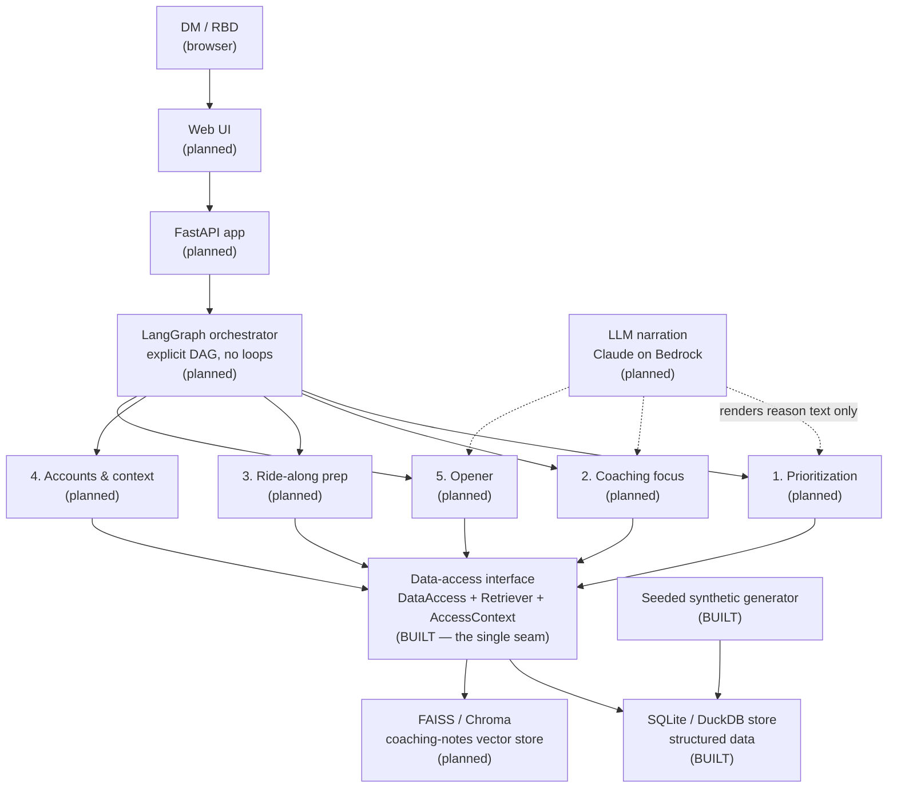
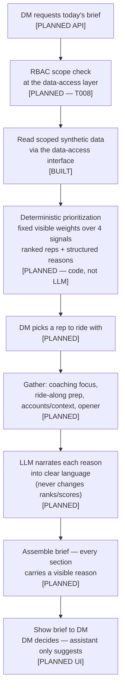

# Field Intelligence Coach Agent

An AI assistant that helps **district managers (DMs)** prepare for coaching their sales
representatives and make **fairer** decisions about where to spend limited field time.
Today, coaching preparation is inconsistent — it depends on which manager you get and how
much time they had that morning — and field time tends to be split *equally* rather than
*fairly* (where it is most needed). This project moves the team from "equal to fair" by
producing one clear **morning coaching brief**: who to ride with and why, what to coach,
what happened last time, which accounts matter, and how to open the conversation — with
**every suggestion showing its reason and the data behind it**. The assistant only
*suggests*; the manager always *decides*.

---

## Status

> **This is a proof of concept (POC), built spec-first, using synthetic data only.**

- **Phase 1 (foundation) is complete and tested** — the data schemas, the data-access
  interface (the single seam every component reads through), the SQLite store, the seeded
  synthetic data generator, and configuration are all in place. **17 unit tests pass.**
- **Later phases are planned, not yet built.** RBAC enforcement, the deterministic
  ranking, the five brief components, the LLM narration layer, the orchestrator, the API,
  and the web UI are designed (see the spec and plan) but exist today only as documented
  placeholders. This README is careful to separate **built now** from **planned**.

No real customer, prescriber, or rep data is used anywhere. A pre-commit hook actively
blocks committing files that look like real data.

---

## What the MVP does (the morning coaching brief)

A DM opens the assistant on the morning of a field ride and, in a few minutes, gets a
single brief made of **five sections**:

1. **Who to ride with and why** — a short, ranked list of reps who most need attention
   today, each with a plain-language reason and the business signals behind it.
2. **What to coach this rep on** — 1–3 suggested coaching focus areas, each with its
   reason and supporting data.
3. **What happened last time (ride-along prep)** — the rep's prior coaching notes, the
   actions both sides agreed, and what the DM said they would observe next.
4. **Which accounts/HCPs matter and how the business is doing** — a focused list of key
   accounts with business context (share, volume, performance, spend, recent call
   activity) and flags where the rep's behavior may not match the opportunity.
5. **A suggested opener** — a short way to start the morning business conversation,
   referencing this rep's specific situation. A suggestion the DM can edit or ignore.

**In scope for the MVP:** these five brief sections, scoped to the user's own territory.
**Out of scope for the MVP:** Summit ranking optimization, and aggregating coaching themes
across districts/regions for leadership roll-ups.

---

## Guiding principles

These come from the project constitution (`.specify/memory/constitution.md`) and are
non-negotiable:

- **AI suggests, the human decides.** No autonomous actions — the agent never books,
  sends, commits, or executes anything on its own.
- **Always explain why.** Every recommendation surfaces its reason and the underlying data
  signals. No black-box output.
- **Synthetic data only in the POC.** Data mirrors the *shape* of real data but is fully
  fabricated and clearly labeled synthetic.
- **RBAC by territory, enforced at the data layer.** A DM sees only their own district; an
  RBD sees their region, read-only. Scope is enforced server-side, not just hidden in the
  UI.
- **Ranking is deterministic, not LLM-decided.** The rep prioritization is computed in
  code from fixed, visible weights over legitimate business signals. The LLM only turns
  the structured reason into clear language — it never decides or reorders the ranking.
- **Fair, not biased.** Protected attributes and obvious proxies (e.g. tenure) are
  excluded from the signals that drive prioritization.
- **Quality must be testable.** The five-section checklist rubric and example-based checks
  are enforced by automated tests.

---

## Architecture

Everything reads through **one data-access interface** — components never touch a store
directly. This is the seam that lets the POC swap synthetic data for real AWS-backed
connectors later without a rewrite.



### MVP choice → production AWS service

Each MVP choice is deliberately mapped to a production AWS service, so going to production
is a change of *source/implementation behind the interface*, not a redesign.

| Concern | MVP (now) | Production (AWS) |
|---|---|---|
| Model inference & narration | Claude on **Amazon Bedrock** (model id from config) | Claude on Amazon Bedrock |
| Structured data | Local **SQLite / DuckDB** | **Aurora Postgres** / **Athena + S3** |
| Coaching-notes retrieval (RAG) | Local **FAISS / Chroma** + Bedrock (Titan) embeddings | **Bedrock Knowledge Bases** / **OpenSearch Serverless** |
| Identity & RBAC | Simulated identity → `AccessContext` | **Amazon Cognito** (+ data-layer scope) |
| PII / safety guardrail | Lightweight pass-through hook | **Bedrock Guardrails** |

---

## How a brief is produced

The flow below shows one morning brief end to end. Steps are marked **[BUILT]**
(Phase 1 foundation exists) or **[PLANNED]** (designed, not yet implemented).



What exists **today** is the spine the rest hangs on: the schemas that force every
recommendation to carry a non-empty `reason`, the data-access interface and `AccessContext`
that all reads pass through, the SQLite store, and the seeded generator that produces a
repeatable two-district synthetic dataset with varied ranking signals and edge cases.

---

## Tech stack

- **Language:** Python 3.11+
- **API:** FastAPI (planned)
- **Orchestration:** LangGraph — an explicit, code-defined DAG (no autonomous agent
  loops), so the flow stays testable and reviewable (planned)
- **LLM:** Claude on **Amazon Bedrock**; the model id is read from configuration, never
  hard-coded
- **Stores (MVP):** SQLite / DuckDB for structured data; FAISS / Chroma for the
  coaching-notes RAG
- **Validation:** Pydantic schemas (including the structured `Reason` object)
- **Tests:** pytest (unit now; component and end-to-end planned)
- **Tooling:** `uv` for environments/deps; `ruff` for lint + format

---

## How to read this repo (repository guide)

```text
field-intelligence-coach-agent/
├── README.md                       # you are here
├── CLAUDE.md                       # golden rules + stack + commands for contributors/agents
├── pyproject.toml                  # deps, pytest config, ruff config
├── .githooks/pre-commit            # blocks committing real (non-synthetic) data
├── .specify/                       # Spec Kit + the project constitution
│   └── memory/constitution.md      # the 9 non-negotiable principles
├── specs/001-morning-coaching-brief/
│   ├── spec.md                     # WHAT & WHY: user stories, requirements, success criteria
│   ├── plan.md                     # HOW: architecture, constitution check, structure
│   ├── tasks.md                    # the dependency-ordered task list (T001…T043)
│   └── checklists/                 # spec-quality checklist(s)
├── src/coach/
│   ├── schemas.py                  # BUILT — entities, Reason, recommendation objects, Dataset
│   ├── config/settings.py          # BUILT — model id (from env), seed, fixed ranking weights
│   ├── data_access/
│   │   ├── interface.py            # BUILT — DataAccess + Retriever + AccessContext + ScopeError
│   │   └── sqlite_store.py         # BUILT — structured store (RBAC enforcement is T008)
│   ├── synthetic/generate.py       # BUILT — seeded synthetic data generator (CLI)
│   ├── components/                 # placeholder — the 5 brief sections (planned)
│   ├── llm/                        # placeholder — Bedrock Claude + embeddings (planned)
│   ├── guardrails/                 # placeholder — PII guardrail seam (planned)
│   ├── orchestrator/               # placeholder — LangGraph DAG + brief assembly (planned)
│   ├── observability/              # placeholder — per-brief / per-LLM audit (planned)
│   └── api/                        # placeholder — FastAPI app (planned)
├── tests/
│   ├── unit/test_schemas.py        # BUILT — every recommendation requires a non-empty reason
│   ├── unit/test_data_access.py    # BUILT — seeded shape, determinism, synthetic provenance
│   ├── component/                  # planned — per-component tests
│   └── e2e/                        # planned — rubric, audit, synthetic-only, quickstart
└── web/                            # placeholder — minimal brief UI (planned)
```

**Recommended reading order for a newcomer:**

1. `.specify/memory/constitution.md` — the rules everything obeys.
2. `specs/001-morning-coaching-brief/spec.md` — what we're building and why.
3. `specs/001-morning-coaching-brief/plan.md` — the architecture and the AWS mapping.
4. `src/coach/schemas.py` then `src/coach/data_access/interface.py` — the data contracts
   and the single read-seam that shape all the code.
5. `src/coach/synthetic/generate.py` and `src/coach/data_access/sqlite_store.py` — how the
   synthetic data is made and stored.
6. `tests/unit/` — the behavior that is actually guaranteed today.
7. `specs/001-morning-coaching-brief/tasks.md` — exactly what is done and what is next.

---

## The spec-driven workflow we followed

This project was built spec-first to keep the rigor visible. The steps, in order:

1. **Constitution** — ratify the non-negotiable principles.
2. **Specify** — write the feature spec (user stories, requirements, success criteria).
3. **Clarify** — resolve open questions and record the answers back into the spec.
4. **Plan** — produce the technical plan and pass the Constitution Check gate.
5. **Tasks** — generate a dependency-ordered task list (T001…T043).
6. **Analyze** — cross-check spec ↔ plan ↔ tasks for consistency.
7. **Implement in small phases** — Phase 1 (foundation) first, validated by tests, before
   any component work begins.

---

## How to run it

This project uses [`uv`](https://docs.astral.sh/uv/).

```bash
# 1. Install dependencies into a local environment
uv sync

# 2. Generate the seeded synthetic dataset (repeatable; writes ./data/coach.db)
uv run python -m coach.synthetic.generate --seed 42

# 3. Run the test suite (17 tests today)
uv run pytest
```

Lint and format (optional): `uv run ruff check --fix . && uv run ruff format .`

> The API (`uvicorn coach.api.app:app --reload`) and the web UI are planned and not yet
> runnable.

---

## Roadmap

| Phase | Scope | Status |
|---|---|---|
| **Phase 1** | Foundation: schemas, data-access interface, SQLite store, seeded synthetic generator, config | ✅ **Done & tested** |
| **Phase 2** | RBAC enforced at the data-access layer (DM = own district; RBD = region, read-only) | ⏳ Planned (next — T008) |
| **Phase 3** | Deterministic rep ranking (code) + LLM reason narration + `GET /api/reps` | ⏳ Planned |
| **Phase 4–7** | The five brief sections: coaching focus, ride-along prep, accounts/context, opener | ⏳ Planned |
| **Phase 8** | Assembly + 5-section rubric eval + audit/observability + FastAPI; then the web UI | ⏳ Planned |

---

## Data & compliance note

- **Synthetic data only** for this POC — no real Veeva, IQVIA, AEBAT, or Summit data ever
  enters the environment; synthetic data is clearly labeled (`synthetic=true`) and never
  presented as real performance.
- This is a **commercial system, not GxP** — but it is designed to be governed, secure,
  and auditable from day one.
- **HCP/prescriber data is treated as private** (IQVIA / PDRP rules) and **rep performance
  data as HR-sensitive**, in how it is scoped, displayed, and (later) logged.
- **RBAC and explainability are designed in, not bolted on:** access is enforced at the
  data layer, and every recommendation must carry its reason. Designing for the strictest
  rules now means that swapping in real data later is a data-source change, not a security
  or compliance redesign.
