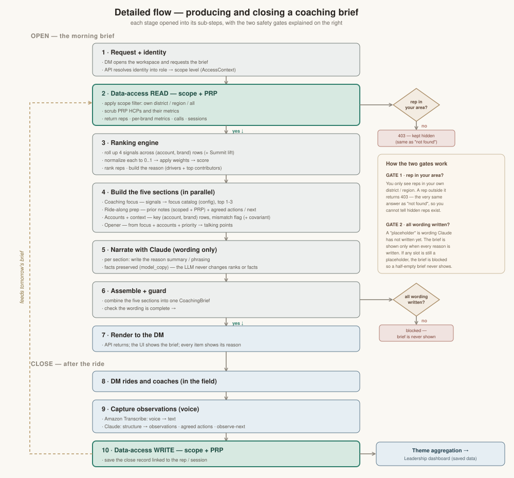
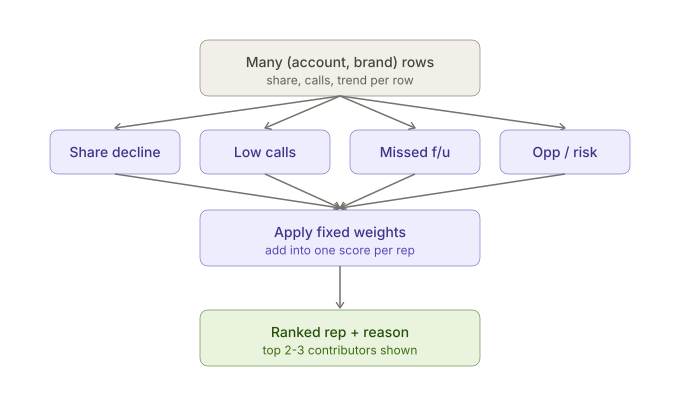
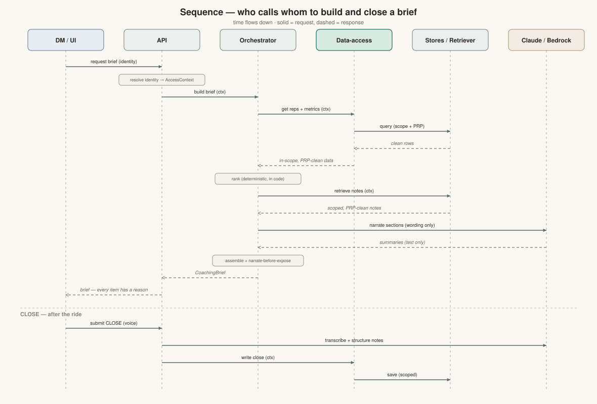

# Field Intelligence Coach Agent

An AI assistant that helps **district managers (DMs)** prepare for coaching their sales
representatives and make **fairer** decisions about where to spend limited field time.
Today, coaching preparation is inconsistent — it depends on which manager you get and how
much time they had that morning — and field time tends to be split *equally* rather than
*fairly* (where it is most needed). This project moves the team from "equal to fair" by
producing one clear **morning coaching brief**: who to ride with and why, what to coach,
what happened last time, which accounts matter, and how to open the conversation — with
**every suggestion showing its reason and the data behind it**. The assistant only
*suggests*; the manager always *decides*.

---

## Status

> **This is a proof of concept (POC), built spec-first, using synthetic data only.**
> **All ten build phases are complete, and all six original capabilities are built and
> tested end to end on synthetic data.** `pytest` → **182 passing**. The
> **architecture and flow diagrams show the complete target system — now fully built**.
> The assistant only *suggests*; the human (DM or a region-level role) always *decides*.
>
> 📌 **Living status & open items:** [`docs/project-status.md`](docs/project-status.md) is
> the project's living memory — the detailed, up-to-date status, decisions, and open items.

### The six capabilities (all built and tested)

1. ✅ **Prioritize reps + why** — a ranked list of reps who need attention, each with its reason.
2. ✅ **Coaching focus + verbal feedback / CLOSE loop** — focus areas for the chosen rep, plus
   the CLOSE record (text and voice) that closes the OPEN→CLOSE loop.
3. ✅ **Ride-along prep** — prior notes, agreed actions, and what to observe next.
4. ✅ **Business outcomes + covariant analysis** — key accounts with per-brand context and a
   transparent, code-computed covariant association.
5. ✅ **Summit optimization** — a per-team Summit / IC-plan lift as a deterministic ranking signal.
6. ✅ **Theme aggregation for leadership** — a scoped, aggregate-only view of common coaching
   themes (patterns and counts only, never named individuals).

### The morning coaching brief (the MVP) and its five sections

- The **morning coaching brief** and its **five sections**:
  1. **Rep + reason** — a ranked list of reps who need attention, each with its reason.
  2. **Coaching focus** — 1–3 focus areas for the chosen rep, each with its reason.
  3. **Ride-along prep** — prior notes, agreed actions, and what to observe next.
  4. **Accounts / business context** — key accounts with context (labeled **by brand**),
     mismatch flags, and the covariant analysis.
  5. **Opener** — a short, editable way to start the morning conversation.
- The **OPEN** (the morning brief) and the **CLOSE** (end-of-session observations and
  development focus — captured by text or by voice) are both built; the loop closes
  (voice → saved → next ride-along prep).
- **Primary user: the district manager (DM).** A DM sees **only their own district**. The
  **region-level role has FULL access** (it can take actions, e.g. add notes or flag a
  rep) — it is *not* read-only. The exact role names (**RD**, **RBE**) and the hierarchy
  are **pending confirmation** — see [`docs/project-status.md`](docs/project-status.md).

### Assumptions to confirm

A few choices are clearly-labeled assumptions to confirm with the business — none blocks
the build, each is swappable from config without code change:

- The **Summit placeholder formula** and its per-team **`recovery_fraction`** (default 1.0)
  are a representative placeholder, to be replaced with the real per-team Summit formula.
- The covariant analysis's **"success" measure** is a labeled default assumption to confirm.
- The **RD / RBE** role-name terminology is still pending confirmation.

### Beyond the capabilities (future productionization)

These are **not capability gaps** — every capability is built. They are the steps to take
this POC to production:

- **Real data connectors** — Veeva, IQVIA, AEBAT, performance dashboards, and Summit files,
  swapped in behind the same data-access interface.
- **Authentication** — Amazon Cognito.
- **Production data platform** — Amazon Aurora / Athena (structured) and Amazon Bedrock
  Knowledge Bases / OpenSearch (coaching-notes RAG).
- **A polished + leadership UI** — a leadership dashboard surfacing the theme aggregation,
  Summit, and covariant insights. The components are built, but no screen/route exposes them yet.
- **The deferred performance / latency test** (SC-001), intentionally deferred for the MVP.
- **The PII guardrail seam** (`src/coach/guardrails/`) is a placeholder, to be wired to
  Amazon Bedrock Guardrails.

### Success criteria

From the spec's measurable outcomes — these are the bar the MVP must clear:

- A DM can prepare for the conversation in **under ~5 minutes** (SC-001).
- **100% of recommendations show a reason** and the data behind them (SC-002).
- **100% of data shown is in the user's territory** — zero out-of-scope reps, accounts,
  or HCPs (SC-003).
- Preparation is **more consistent and complete** than working without the assistant,
  scored against the fixed **5-section checklist rubric** (SC-004, SC-005).
- **Every recommendation type passes its example-based checks** on seeded data, so results
  are **repeatable** (SC-006).
- **100% synthetic data** — no real customer, prescriber, or rep data anywhere (SC-007).
  A pre-commit hook actively blocks committing files that look like real data.

---

## What the MVP does (the morning coaching brief)

A DM opens the assistant on the morning of a field ride and, in a few minutes, gets a
single brief made of **five sections**:

1. **Who to ride with and why** — a short, ranked list of reps who most need attention
   today, each with a plain-language reason and the business signals behind it.
2. **What to coach this rep on** — 1–3 suggested coaching focus areas, each with its
   reason and supporting data.
3. **What happened last time (ride-along prep)** — the rep's prior coaching notes, the
   actions both sides agreed, and what the DM said they would observe next.
4. **Which accounts/HCPs matter and how the business is doing** — a focused list of key
   accounts with business context (share, volume, performance, spend, recent call
   activity), **labeled and broken down by brand**, and flags where the rep's behavior may
   not match the opportunity. Performance metrics are attributable to an
   **(account, brand)** pair, so one account can carry metrics across multiple brands.
5. **A suggested opener** — a short way to start the morning business conversation,
   referencing this rep's specific situation. A suggestion the DM can edit or ignore.

These five brief sections are scoped to the user's own territory. Beyond the brief, the
other capabilities are built too: Summit ranking optimization, the covariant analysis, the
CLOSE capture (text and voice), and a **scoped, aggregate-only** leadership theme view
showing patterns and counts, never named individuals.

---

## Guiding principles

These come from the project constitution (`.specify/memory/constitution.md`) and are
non-negotiable:

- **AI suggests, the human decides.** No autonomous actions — the agent never books,
  sends, commits, or executes anything on its own.
- **Always explain why.** Every recommendation surfaces its reason and the underlying data
  signals. No black-box output.
- **Synthetic data only in the POC.** Data mirrors the *shape* of real data but is fully
  fabricated and clearly labeled synthetic.
- **RBAC by territory, enforced at the data layer.** A DM sees only their own district;
  the region-level role has **full access** (it can take actions), not read-only. Scope is
  enforced server-side, not just hidden in the UI. (Exact role names — RD, RBE — and the
  hierarchy are pending confirmation; see [`docs/project-status.md`](docs/project-status.md).)
- **PRP prescriber-data restriction.** HCPs flagged **PRP** are scrubbed at the
  data-access layer before any result reaches a field user (enforced on every read).
- **Brand-aware data.** Performance is per **(account, brand)**; the five brand names live
  in **one** place (the `Brand` enum) so they are easy to change.
- **Ranking is deterministic, not LLM-decided.** The rep prioritization is computed in
  code from fixed, visible weights over legitimate business signals. The LLM only turns
  the structured reason into clear language — it never decides or reorders the ranking.
- **Fair, not biased.** Protected attributes and obvious proxies (e.g. tenure) are
  excluded from the signals that drive prioritization.
- **Quality must be testable.** The five-section checklist rubric and example-based checks
  are enforced by automated tests.

---

## How it is built (the layers)

The system is built in **layers**, stacked from the people who use it down to where the
data lives. The most important rule is simple: **every part reads data through one shared
door — the data-access layer.** Because everything goes through that one door, we can swap
today's fake (synthetic) data for real data later without redoing the work above it.


*Complete target architecture — the full system with every capability, now fully built.*

The **data-access layer is the single door** every part reads and writes through, and it is
where **RBAC** (scope levels: self / district / region / all) and **PRP scrubbing** are
enforced on **every read**. **Claude only writes the wording** (the reason text in clear
language) — it never decides or reorders the ranking, and it never touches the stores directly.

- **District manager &amp; regional business director** — the people the brief is for.
- **Web app (UI)** — the screen where they open and read the brief.
- **Coaching brief orchestrator** — the coordinator that runs the steps and puts the brief
  together.
- **The 5 brief builders** — one per brief section: rank the reps, suggest coaching focus,
  pull last-time prep, gather key accounts and business context, and draft an opener.
- **Data-access layer** — the single shared door every part reads through; this is also
  where access control (RBAC) is enforced, so a user only ever sees their own territory.
- **Data stores** — where the data lives: a local SQLite/DuckDB database for rep, account,
  and activity data, plus a notes store for coaching notes. All synthetic for the POC.

### From POC to production

Each POC piece is built to be swapped for a managed AWS service later — without changing
the layers above it.

| POC piece (now) | Future AWS service |
|---|---|
| Web app | Same web app, hosted on AWS |
| Orchestrator / brief builders | LangGraph + Claude on Amazon Bedrock |
| Data-access layer | Same interface, with real connectors behind it |
| Local SQLite / DuckDB | Amazon Aurora / Athena |
| Notes store | Amazon Bedrock Knowledge Bases / OpenSearch |
| Access control | Amazon Cognito |
| Safety checks | Amazon Bedrock Guardrails |

---

## What happens when a manager uses it (the flow)

Here is the step-by-step of one morning, from the moment the DM opens the app to seeing
the finished brief — and the matching CLOSE step after the ride.



*The full coaching loop — OPEN (morning brief) and CLOSE (record after the ride). Two
safety gates: rep-in-scope, and narrate-before-expose (no half-written brief is ever shown).*

The OPEN (morning brief):

1. The DM asks for today's brief, the morning of a field ride.
2. The data-access layer checks the DM's scope (own district only) and scrubs out any PRP
   physicians, then returns only the data they are allowed to see. **(Gate 1: rep-in-scope.)**
3. The ranking engine scores the reps and produces a ranked list, each rep with a reason.
4. The DM (or the app) picks the top rep, and the system gathers the rest for that rep:
   coaching focus, what happened last time, key accounts with per-brand business context,
   and a suggested opener.
5. Claude writes the reason text in clear language — wording only. It never changes the
   ranking.
6. The brief is assembled and validated before anything is shown: if any section is still
   un-narrated it is never returned. **(Gate 2: narrate-before-expose.)** The one-page brief,
   every item showing its reason, is shown to the DM.

**The OPEN morning brief is built and tested end to end** — the data-access layer (RBAC + PRP
enforced), the deterministic ranking, all five brief builders, the orchestrator, the read-only
API, and the web UI. The **CLOSE** half of the loop (recording observations after the ride —
the first write path, by text or by voice) is **built and tested** too: the write goes through
the same data-access door under writer-scope RBAC, the readback is PRP-scrubbed, and the loop
closes (voice → saved → next ride-along prep).

---

## How rep ranking works (the rollup)



*How rep ranking rolls up the signals — many (account, brand) rows become one normalized,
weighted score per rep, with the top contributors kept for the reason.*

A rep covers many accounts, and each account can carry several brands (LUPRON PEDS,
Synthroid, and so on). So in the data, each rep has many small rows — one per (account,
brand) pair. To rank reps, we need one score per rep. The rollup is the step that squeezes
those rows into one number per signal, then combines the four signals into one score.

For each of the four signals — declining share, low call activity in key accounts, missed
coaching follow-up, and opportunity/risk — we aggregate across the rep's (account, brand)
rows into one signal value per rep. We then multiply each signal by a fixed, visible weight
(the same weights for every rep) and add them up. That sum is the rep's score, and reps are
ranked by score. The reason shows the top 2-3 contributing (account, brand) pairs, so the
DM sees the real "why," not just a number.

Three properties always hold: the score is deterministic (same data always gives the same
score — the LLM does not decide it), explainable (the reason names the contributors), and
fair (fixed weights, the same for every rep).

---

## Who calls whom (the sequence)

The same morning, viewed as messages between the parts — the API resolves the caller's
identity into a scope, the orchestrator runs the builders through the single data-access
door, and the assembled brief comes back.



*Who calls whom to build and close a brief — solid = request, dashed = response.*

---

## Technical architecture

For engineers, a detailed technical reference lives in
**[docs/technical-architecture.md](docs/technical-architecture.md)**. It walks the
**complete target architecture** layer by layer (matching the diagram above), plus the
package map under `src/coach/`, the data-access seam (`DataAccess`/`Retriever` Protocols,
`AccessContext`, `ScopeError`), the data model, the LangGraph orchestration and the
deterministic ranking, the coaching-notes RAG, LLM integration, the explainability
contract, security/privacy, and the POC→AWS production mapping. For the detailed, living
build status, [`docs/project-status.md`](docs/project-status.md) is the source of truth.

---

## Tech stack

- **Language:** Python 3.11+
- **API:** FastAPI — read-only GET endpoints (`/api/whoami`, `/api/reps`, `/api/brief/{rep_id}`)
- **Orchestration:** LangGraph — an explicit, code-defined DAG (no autonomous agent
  loops), so the flow stays testable and reviewable
- **LLM:** Claude on **Amazon Bedrock**; the model id is read from configuration, never
  hard-coded
- **Stores (MVP):** SQLite / DuckDB for structured data; an in-memory vector store for the
  coaching-notes RAG (→ FAISS / Chroma / Bedrock Knowledge Bases in production)
- **Validation:** Pydantic schemas (including the structured `Reason` object)
- **Tests:** pytest — unit, component, and end-to-end (182 tests)
- **Tooling:** `uv` for environments/deps; `ruff` for lint + format

---

## How to read this repo (repository guide)

```text
field-intelligence-coach-agent/
├── README.md                       # you are here
├── CLAUDE.md                       # golden rules + stack + commands for contributors/agents
├── docs/
│   ├── project-status.md           # living memory: BUILT vs DECIDED vs OPEN + open items
│   └── technical-architecture.md   # engineer reference (module map, data model, flows)
├── pyproject.toml                  # deps, pytest config, ruff config
├── .githooks/pre-commit            # blocks committing real (non-synthetic) data
├── .specify/                       # Spec Kit + the project constitution
│   └── memory/constitution.md      # the 9 non-negotiable principles
├── specs/001-morning-coaching-brief/
│   ├── spec.md                     # WHAT & WHY: user stories, requirements, success criteria
│   ├── plan.md                     # HOW: architecture, constitution check, structure
│   ├── tasks.md                    # the dependency-ordered task list (T001…T043)
│   └── checklists/                 # spec-quality checklist(s)
├── src/coach/
│   ├── schemas.py                  # BUILT — entities, Reason, recommendation objects, Dataset; Brand enum, prp flag, AccountBrandMetrics (per account+brand)
│   ├── config/settings.py          # BUILT — model id (from env), seed, fixed ranking weights
│   ├── data_access/
│   │   ├── interface.py            # BUILT — DataAccess + Retriever + AccessContext + ScopeError
│   │   ├── rbac.py                 # BUILT — scope-level RBAC + PRP scrubbing helpers
│   │   ├── sqlite_store.py         # BUILT — structured store (RBAC + PRP enforced on every read)
│   │   └── notes_retriever.py      # BUILT — coaching-notes RAG (RBAC + PRP at query time, ADR 0002)
│   ├── synthetic/generate.py       # BUILT — seeded synthetic data generator (CLI)
│   ├── components/                 # BUILT — the 5 brief sections (ranking, focus, ride-along, accounts, opener)
│   ├── llm/                        # BUILT — Bedrock Claude client + embeddings + narration (wording only)
│   ├── orchestrator/               # BUILT — LangGraph DAG (brief_graph) + assembly + rubric (ADR 0003)
│   ├── observability/              # BUILT — privacy-safe per-brief audit / logging
│   ├── api/                        # BUILT — read-only FastAPI app + offline demo server
│   ├── components/theme_aggregation.py  # BUILT — scoped, aggregate-only leadership theme roll-up (cap #6)
│   ├── components/summit.py        # BUILT — per-team Summit lift as a deterministic ranking signal (cap #5)
│   ├── components/covariant.py     # BUILT — transparent covariant analysis in the accounts section (cap #4)
│   ├── components/close_capture.py # BUILT — CLOSE capture (text + voice draft) via the write path (cap #2)
│   ├── llm/transcribe.py           # BUILT — Amazon Transcribe seam (+ offline fake) for voice capture
│   └── guardrails/                 # placeholder — PII guardrail seam (to wire to Bedrock Guardrails)
├── tests/
│   ├── unit/                       # BUILT — schemas, data-access, RBAC, PRP, ranking (+ golden)
│   ├── component/                  # BUILT — coaching focus, notes retriever, ride-along, accounts, opener
│   └── e2e/                        # BUILT — brief rubric, API (RBAC/PRP/403), audit, UI
└── web/index.html                 # BUILT — minimal read-only brief UI
```

**Recommended reading order for a newcomer:**

1. `.specify/memory/constitution.md` — the rules everything obeys.
2. `specs/001-morning-coaching-brief/spec.md` — what we're building and why.
3. `specs/001-morning-coaching-brief/plan.md` — the architecture and the AWS mapping.
4. `src/coach/schemas.py` then `src/coach/data_access/interface.py` — the data contracts
   and the single read-seam that shape all the code.
5. `src/coach/synthetic/generate.py` and `src/coach/data_access/sqlite_store.py` — how the
   synthetic data is made and stored.
6. `tests/unit/` — the behavior that is actually guaranteed today.
7. `specs/001-morning-coaching-brief/tasks.md` — exactly what is done and what is next.

---

## Engineering setup (Claude Code)

This repo ships with a small Claude Code setup that bakes the constitution into the daily
workflow: focused subagents for common jobs, two manual slash commands, and automatic
guardrails that run without anyone remembering to invoke them.

### Subagents (`.claude/agents/`)

- **`data-explorer`** — read-only investigation of the synthetic dataset and the repo
  (find files, search code, run `SELECT`-style reads). Use it to gather facts *before* a
  change without cluttering the main context; it can never write, edit, or delete. Runs on
  a **cheap/fast model (Haiku)** because the work is lookup-and-summarize, not deep
  reasoning.
- **`test-runner`** — runs `pytest -q` and reports a short pass/fail summary, naming any
  failing tests with a one-line likely cause. Use it after code changes to validate; it
  does not fix code itself. Runs on a **cheap/fast model (Haiku)** since running tests and
  summarizing output is mechanical.
- **`constitution-guardian`** — reviews proposed code or changes against the **9
  constitution principles**, flagging each issue with the file, the rule broken, and a
  concrete fix (and watching for the LLM deciding the ranking). Use it before committing a
  feature or when unsure a change is allowed. Runs on a **strong model (Opus)** because
  judging subtle principle violations needs real reasoning.

### Skills / slash commands (`.claude/skills/`)

Both are **manual-only** — they are marked `disable-model-invocation: true`, so they never
auto-run; you trigger them explicitly.

- **`/gen-synthetic-data`** — builds (or runs) the seeded synthetic data generator:
  1 region, 2 districts, 8–12 reps each, 15–30 accounts/HCPs per rep, 2–3 coaching
  sessions, with a fixed seed for repeatability and the four ranking signals varied across
  reps.
- **`/run-checklist-eval`** — runs the fixed 5-section rubric check on generated briefs: a
  brief passes only if all five sections are present and every recommendation shows a
  visible reason, plus the example-based (seeded) checks and a synthetic-only confirmation.

### Automatic guardrails (hooks)

- **Git pre-commit hook (`.githooks/pre-commit`)** — blocks any commit that stages files
  looking like real (non-synthetic) data (e.g. `data/real/`, `real_data/`, `*.real.csv`).
  It exists to enforce the **synthetic-only rule at commit time** — the last safe moment —
  so real data can never slip into the repo.
- **PostToolUse format hook (`.claude/settings.json` → `scripts/claude-format-hook.sh`)**
  — after Claude edits or writes a file, automatically runs `ruff check --fix` and
  `ruff format` on any `.py` file. It exists to keep formatting and lint consistent
  automatically, so style never has to be policed by hand in review.

**Why this matters:** these pieces enforce our constitution automatically and keep quality
consistent (operational excellence), so the project does not rely on people remembering
the rules.

---

## The spec-driven workflow we followed

This project was built spec-first to keep the rigor visible. The steps, in order:

1. **Constitution** — ratify the non-negotiable principles.
2. **Specify** — write the feature spec (user stories, requirements, success criteria).
3. **Clarify** — resolve open questions and record the answers back into the spec.
4. **Plan** — produce the technical plan and pass the Constitution Check gate.
5. **Tasks** — generate a dependency-ordered task list (T001…T043).
6. **Analyze** — cross-check spec ↔ plan ↔ tasks for consistency.
7. **Implement in small phases** — Phase 1 (foundation) first, validated by tests, before
   any component work begins.

---

## How to run it

This project uses [`uv`](https://docs.astral.sh/uv/).

```bash
# 1. Install dependencies into a local environment
uv sync

# 2. Generate the seeded synthetic dataset (repeatable; writes ./data/coach.db)
uv run python -m coach.synthetic.generate --seed 42

# 3. Run the test suite (182 tests)
uv run pytest
```

Lint and format (optional): `uv run ruff check --fix . && uv run ruff format .`

**See the brief in a browser:**

```bash
# Offline demo — no AWS needed. Auto-seeds synthetic data and uses an offline
# narrator + fake embeddings, so the whole page renders with no live Bedrock call.
uv run uvicorn coach.api.demo:app --reload
# then open http://127.0.0.1:8000/  (switch the seeded user dm_d1 / dm_d2 /
# region_r1 / hos_1 to see RBAC scope change; open a rep for the full brief)
```

For the production wiring, run the main API with the Bedrock config set
(`BEDROCK_MODEL_ID`, `AWS_REGION`, `BEDROCK_EMBED_MODEL_ID`) and a seeded DB, then open the
page:

```bash
uv run uvicorn coach.api.app:app --reload
# then open http://127.0.0.1:8000/
```

Both serve the same read-only page at `/`.

---

## Roadmap

**All ten phases are done and tested end to end on synthetic data** (`pytest` → **182
passing**). The architecture and flow diagrams above show the *complete target* system — now
fully built.

| Phase | Scope | Status |
|---|---|---|
| **Phases 1–6** | **The morning coaching brief** — synthetic data → RBAC/PRP data-access → deterministic ranking → the five sections → orchestrated, narrated, validated brief → read-only API → web UI | ✅ **Done** |
| **Phase 7** | **Theme aggregation** (capability #6) — a leadership view of themes across reps: **patterns and counts only, never named individuals**, and **RBAC-scoped** (region / all only, within their own scope); small-cell suppression | ✅ **Done** |
| **Phase 8** | **Summit optimization** (capability #5) — the Summit / IC-plan lift as a ranking signal **computed in code** (deterministic, per-team config placeholder, swappable); the LLM never scores it | ✅ **Done** |
| **Phase 9** | **Covariant analysis** (capability #4) — deeper accounts insight **computed in code** (deterministic, not LLM-decided), against a config-driven "success" measure; insufficient-data handled honestly | ✅ **Done** |
| **Phase 10** | **Verbal feedback / CLOSE capture** (capability #2) — **record** the DM's post-ride observations by text or by voice (the first write path): same door, writer-scope RBAC, PRP-scrubbed on readback; the loop closes | ✅ **Done** |

Task IDs for every phase come straight from `specs/001-morning-coaching-brief/tasks.md`;
the detailed, living build status is in [`docs/project-status.md`](docs/project-status.md).

### Beyond the capabilities (future productionization)

These are **not capability gaps** — every capability is built. They are the steps to take
this POC to production, behind the same architecture:

- **Real data connectors** — swap the synthetic stores for Veeva, IQVIA, AEBAT, performance
  dashboards, and Summit files behind the same data-access interface.
- **Authentication** — Amazon Cognito.
- **Production data platform** — Amazon Aurora / Athena (structured) and Amazon Bedrock
  Knowledge Bases / OpenSearch (coaching-notes RAG).
- **A polished + leadership UI** — a leadership dashboard surfacing the theme aggregation,
  Summit, and covariant insights. The components are built, but no screen/route exposes them yet.
- **The deferred performance / latency test** (SC-001), intentionally deferred for the MVP.
- **The PII guardrail seam** (`src/coach/guardrails/`) is a placeholder, to be wired to
  Amazon Bedrock Guardrails.

*The built phases (1–10) in detail:*

### Phase 1 — Foundation · STATUS: ✅ Done

- **Delivers:** the data-access interface (the single seam every component reads through),
  the data schema (with the required `reason` object), a local SQLite store, the **`Brand`
  enum** (five brands), the **`prp` flag** on HCPs/accounts, **per-(account, brand) metrics**
  (`AccountBrandMetrics`), and the seeded synthetic generator (1 region, 2 districts, varied
  ranking signals + edge cases; ~5–10% of HCPs flagged PRP; metrics spread across the five
  brands), plus tests.
- **Tasks:** T001–T007, T009, the amendment **T007A** (`prp` + brand columns + `Brand` enum)
  and the T009 generator amendment, and the tests T018, T019.

### Phase 2 — RBAC + PRP enforcement · STATUS: ✅ Done

- **Delivers:** **scope-level access** (self / district / region / all) enforced **at the
  data-access layer**, with an out-of-scope read raising `ScopeError`, and **PRP scrubbing
  on every read** (PRP-flagged HCPs never reach a field user), plus tests. Non-rep roles have
  full access (no read-only); the role → scope-level mapping comes from one config source.
- **Tasks:** T008 (RBAC in the data layer), T008A (PRP scrubbing), T017 (RBAC tests),
  T017A (PRP scrubbing tests).

### Phase 3 — Deterministic ranking · STATUS: ✅ Done

- **Delivers:** a **pure-code scorer** over the four business signals (declining share, low
  call activity, missed follow-up, opportunity/risk) with a **per-(account, brand) rollup**;
  signals are **normalized to 0..1 so the config weights control influence**
  ([ADR 0001](docs/adr/0001-signal-normalization.md)); every ranking carries a **structured
  reason**; **LLM narration is limited to wording** — it never decides or reorders the ranking
  (anti-LLM-ranking guard).
- **Tasks:** T023 (deterministic scorer), T024 (LLM narration, text only); tests T020
  (scorer/weights), T021 (golden + anti-LLM guard), T022 (explainability), T022a (fairness).

### Phase 4 — Brief sections · STATUS: ✅ Done (all four)

Each section: the logic is decided in **deterministic code**, every item carries a
**structured reason**, and the **LLM writes wording only** (anti-LLM guard).

- **Coaching focus** — 1–3 focus areas from a config catalog/thresholds, each with a reason:
  T027 (build), T026 (test).
- **Ride-along prep** — prior notes via the **notes retriever / RAG**
  ([ADR 0002](docs/adr/0002-notes-retriever-rbac-prp.md): RBAC + PRP enforced at query time)
  plus agreed actions / observe-next from the structured store; empty state when no history:
  T010/T011 (embeddings + retriever seam), T030 (build), T029 (test).
- **Accounts / business context** — focused key (account, brand) rows, **per-brand** context,
  and the behaviour-vs-opportunity **mismatch flag**: T033 (build), T032 (test).
- **Opener** — short, suggestion-only opener built from the other sections' facts: T036
  (build), T035 (test).

*(The per-section wiring/endpoint tasks — T028, T031, T034, T037 — land with the orchestrator
and API in Phase 5.)*

### Phase 5 — Assembly, rubric, API · STATUS: ✅ Done

- **Delivers:** the **LangGraph orchestrator** — a fixed, deterministic DAG (no agentic loop)
  that threads the `AccessContext` through every section node (RBAC + PRP hold brief-wide) —
  plus brief assembly with **narrate-before-expose** (an un-narrated `PENDING_*` placeholder can
  never reach a user, [ADR 0003](docs/adr/0003-orchestration-and-narrate-before-expose.md)); the
  **5-section checklist rubric** + the **consistency check**; the **read-only FastAPI API**
  (GET-only `/api/whoami`, `/api/reps`, `/api/brief/{rep_id}`) with identity → role → scope from
  config (the caller can't choose scope), an out-of-scope rep returned as a `403`
  indistinguishable from not-found (FR-014), and a **per-request DB connection**; and
  **privacy-safe audit logging** (HR-sensitive rep fields / private HCP fields / raw PII are
  never logged).
- **Tasks:** T015 (orchestrator + assembly), T038 (rubric + consistency), T014/T016/T025/T037
  (audit module + API endpoints), T040 (privacy-in-logging). The superseded read-only guards
  **F6/F8** are now satisfied by the read-only-surface test and the RBAC route tests.

### Phase 6 — UI · STATUS: ✅ Done

- **Delivers:** the minimal `web/index.html` — a **read-only** single page (served at `/` by the
  FastAPI app) that calls **only** the GET API and renders exactly what it returns (no
  client-side ranking or business logic). It lets the viewer act as a seeded user (the API
  enforces scope), shows the ranked reps with their priority reason, opens a rep to the full
  five-section brief, **shows the reason under every recommendation** (FR-010), labels accounts
  **by brand** with the mismatch flag, and handles empty states and a clean `403` without
  revealing whether a rep exists. An **offline demo server** (`coach.api.demo`) runs the whole
  page with no live Bedrock call.
- **Tasks:** T039.

---

### Phases 7–10 — the remaining capabilities · STATUS: ✅ Done

These extend the same architecture (and the complete-target diagram above), and each keeps the
same rules: deterministic logic in code, the LLM narrating/structuring wording only (never
decisions, never fabrication), the single data-access door with RBAC + PRP on reads **and**
writes, a reason on everything, synthetic-only, and suggestion/record-only.

- **Phase 7 — theme aggregation (capability #6):** a leadership view of common coaching themes
  across reps. It shows **patterns and counts only — never named individual reps or
  individually identifiable detail** (FR-016, enforced by structural + substring tests), and is
  **RBAC-scoped**: only the **region** and **all** scope levels see it, each only across their
  own region / all regions (a DM is rejected). Small-cell suppression uses a config threshold.
  The themes come from the same shared signals as the per-rep coaching focus, so there is no
  drift. — `src/coach/components/theme_aggregation.py`.
- **Phase 8 — Summit optimization (capability #5):** the **Summit / IC-plan lift** as a ranking
  signal **computed in code** from data + per-team config — deterministic and explainable like
  the four existing signals; **the LLM never scores it**. The per-team Summit formula lives in
  config (a representative placeholder, swappable without code change), the what-if ranking lift
  is computed in code, and it folds in as a normalized ranking signal; `recovery_fraction` is a
  tunable per-team config (default 1.0). — `src/coach/components/summit.py`.
- **Phase 9 — covariant analysis (capability #4):** deeper insight in the accounts/business
  section — which factors move together with results — **computed in code, deterministic and
  explainable, not a black box, not LLM-decided** (the LLM only narrates the structured
  finding). The "success" measure is config-driven (a labeled assumption to confirm), and thin
  data is reported as an honest insufficient-data state, never a fabricated association. —
  `src/coach/components/covariant.py`.
- **Phase 10 — verbal feedback / CLOSE capture (capability #2):** **record** the DM's post-ride
  observations by **text or by voice** — the assistant records the human's input, it does not
  act. The first **write** path goes through the **same door under the writer's own scope
  (writer-scope RBAC)**, with a full PRP scrub on readback (structured fields + free text + id)
  and a collision-free close id. Voice capture uses an **Amazon Transcribe** seam plus Claude
  structuring, where the **observations are the DM's verbatim transcript (the LLM never alters
  them; unstated → empty, never fabricated)**; the draft is reviewed before save, and the loop
  closes (voice → saved → next ride-along prep). — `src/coach/components/close_capture.py`,
  `src/coach/llm/transcribe.py`.

---

## Data & compliance note

- **Synthetic data only** for this POC — no real Veeva, IQVIA, AEBAT, or Summit data ever
  enters the environment; synthetic data is clearly labeled (`synthetic=true`) and never
  presented as real performance.
- **Terminology:** **AEBAT** is a tool/website showing strategic spend and speaker-program
  spend by rep (it is *not* a team). **APEX** is the internal analytics support team (a
  support team / secondary user, *not* a data source).
- **PRP (prescriber data restriction):** HCPs flagged PRP are **scrubbed at the
  data-access layer on every read** before any result reaches a field user (enforced and
  tested). The brand portfolio modeled is LUPRON PEDS, LUPRON URO, LUPRON GYN, Synthroid,
  and LILETTA, held in one `Brand` enum.
- This is a **commercial system, not GxP** — but it is designed to be governed, secure,
  and auditable from day one.
- **HCP/prescriber data is treated as private** (IQVIA / PDRP rules) and **rep performance
  data as HR-sensitive**, in how it is scoped, displayed, and (later) logged.
- **RBAC and explainability are designed in, not bolted on:** access is enforced at the
  data layer, and every recommendation must carry its reason. Designing for the strictest
  rules now means that swapping in real data later is a data-source change, not a security
  or compliance redesign.
