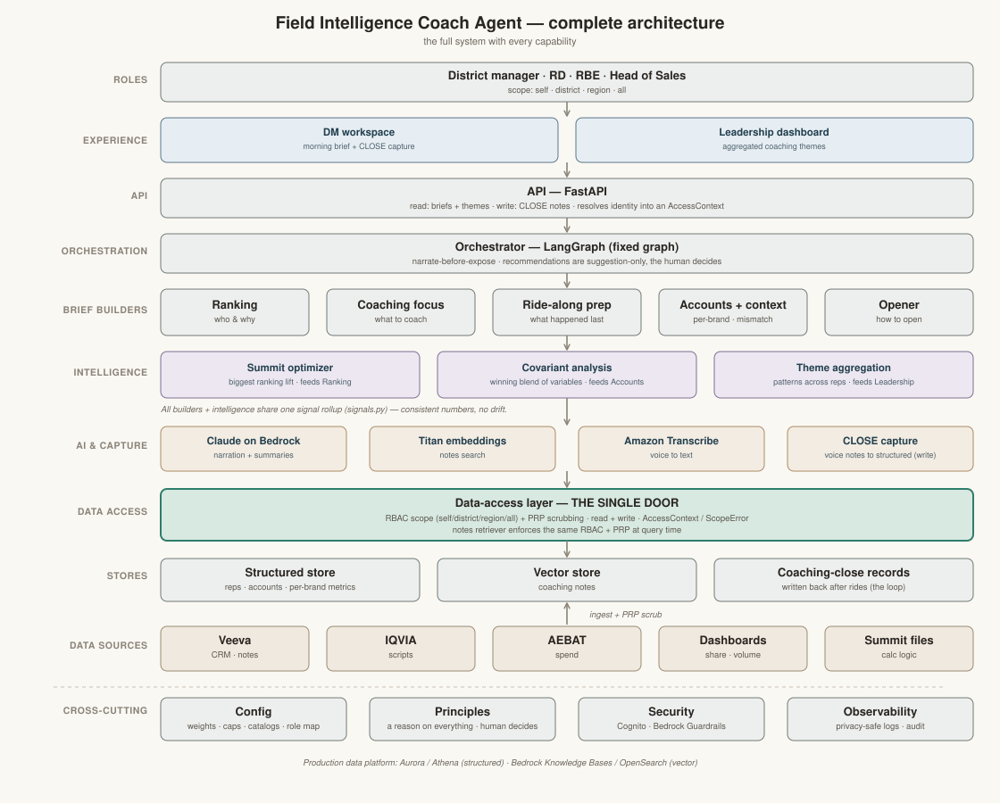
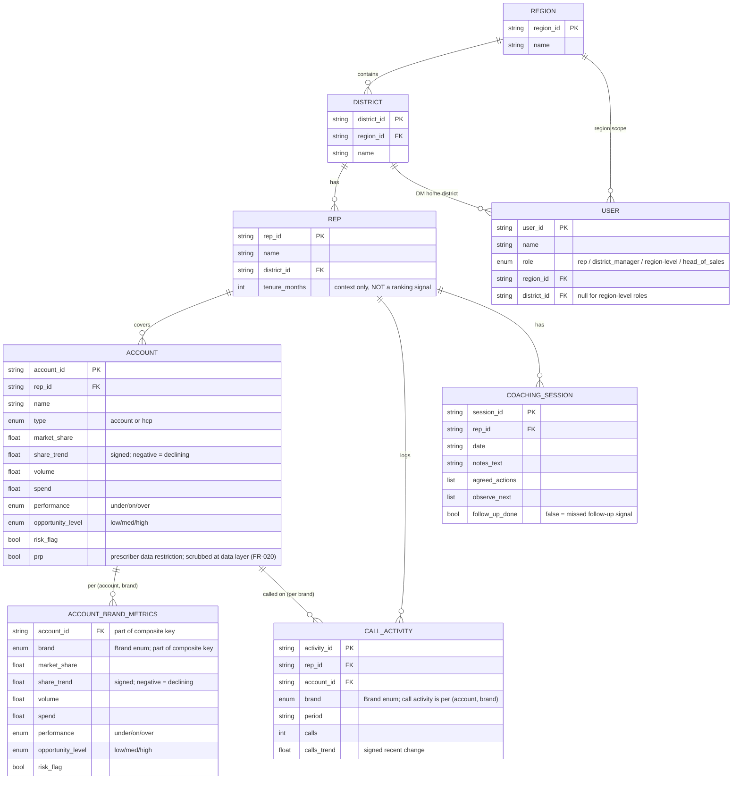

# Technical architecture

> **Audience:** engineers. **Scope:** the **complete, now-fully-built target architecture** of
> the field intelligence coach — the whole system, every capability — described layer by layer
> to match the architecture diagram. The morning coaching brief and all of the post-MVP
> capabilities (Phases 7–10: theme aggregation, Summit optimization, covariant analysis, and
> verbal-feedback / CLOSE capture) are built and tested.
> **For the current build status, [`docs/project-status.md`](project-status.md) is the single
> source of truth** (this doc describes the architecture and does not repeat per-component build
> status).
> Design source: `specs/001-morning-coaching-brief/plan.md`, `tasks.md`, `CLAUDE.md`, and the
> code under `src/coach/`.

---

## 1. Overview

### Diagrams

The **complete target architecture** — the full system with every capability:

Companion diagrams (referenced in the relevant sections below):

- **[`diagrams/flow-detailed.svg`](diagrams/flow-detailed.svg)** — the detailed OPEN→CLOSE
  flow, with the two safety gates (rep-in-scope, and narrate-before-expose).
- **[`diagrams/ranking-rollup.svg`](diagrams/ranking-rollup.svg)** — how rep ranking rolls
  the per-(account, brand) signals up into one score per rep (Section 6).
- **[`diagrams/sequence.svg`](diagrams/sequence.svg)** — a swimlane of who calls whom to
  build and close a brief (solid = request, dashed = response).

### The architecture, layer by layer

Top to bottom, matching the diagram. The unbreakable rule: **every layer reaches data only
through the single data-access door**, which enforces RBAC scope and PRP scrubbing on every
read (and, for the write path, every write).

1. **Roles** — the people the system serves: the **district manager** (own district) and
   **leadership / region-level roles** (their whole region, or all regions). Scope is a
   property of the role, resolved server-side (never chosen by the caller).
2. **Experience** — one web page with **three surfaces**: the **DM morning brief** (read-only,
   with Summit and the covariant association visible), a role-gated **leadership themes view**
   (an **aggregate-only, RBAC-scoped** cross-rep view showing **patterns and counts only, never
   named individual reps**; region / all scope only;
   `components/theme_aggregation.py`), and a **record-close panel** that writes a CLOSE note,
   which then appears in the next brief's ride-along prep.
3. **API** — a FastAPI service. It resolves the caller's identity into an `AccessContext`
   (role → scope, from config) and exposes read endpoints for the brief (`GET /api/whoami`,
   `GET /api/reps`, `GET /api/brief/{rep_id}`), the leadership-scoped `GET /api/themes`
   (region / all only — aggregated patterns/counts, never named individuals; a DM gets the same
   `403` as any out-of-scope caller), and the **one write** `POST /api/brief/{rep_id}/close`,
   which records the DM's own observations through the **same** single-door write
   (`save_close_record`, writer-scope RBAC — not a second path), so the API surface reads
   **and** writes through the one door.
4. **Orchestration** — a fixed, in-code **LangGraph DAG** (no autonomous loops) that runs the
   builders in a deterministic order, assembles the brief, and enforces **narrate-before-expose**
   (Section 5).
5. **The five brief builders** — one per section: **prioritize** (deterministic ranking),
   **coaching focus**, **ride-along prep**, **accounts / business context** (per brand), and
   **opener**. Each returns a recommendation carrying a structured `Reason`.
6. **Intelligence** — analytics that feed the builders and the leadership view, all **computed
   in code** (deterministic, explainable — the LLM never scores or decides them): **Summit /
   IC-plan** lift as a ranking signal (`components/summit.py`), **covariant analysis** of what
   moves with results (`components/covariant.py`), and aggregate-only **theme aggregation**
   across reps for leadership (`components/theme_aggregation.py`).
7. **AI & capture** — **Claude on Amazon Bedrock** (wording only — narrates reasons, drafts
   focus/opener text; never decides ranks/scores), **Titan embeddings** for the notes RAG,
   **Amazon Transcribe** for verbal feedback (`llm/transcribe.py` — a deterministic offline fake
   for tests), and **CLOSE capture** of post-ride observations (`components/close_capture.py` —
   the assistant **records** the human's input, it does not act; the observations are the DM's
   verbatim transcript, which the LLM never alters). A single factory (`make_llm` / `make_embedder`
   in `llm/factory.py`, plus an `OfflineLLM`) picks the real Bedrock provider **iff** a model id
   is configured (`BEDROCK_MODEL_ID` / `BEDROCK_EMBED_MODEL_ID`), otherwise a **deterministic
   offline narrator / embedder** — so the server runs fully offline by default with no AWS and no
   error.
8. **Data-access door** — the single `DataAccess` / `Retriever` seam. **RBAC and PRP scrubbing
   are enforced here on every read** (and every write), so no component can widen scope or see
   a PRP HCP. This is the only layer that talks to the stores.
9. **Stores** — a structured store (SQLite/DuckDB → Aurora/Athena) and a coaching-notes vector
   store (in-memory/FAISS/Chroma → Bedrock Knowledge Bases / OpenSearch). The SQLite store stamps
   a schema version (`PRAGMA user_version = SCHEMA_VERSION`) on generation, and the API verifies it
   at startup, so a stale on-disk DB **fails fast** with a clear "regenerate" message instead of a
   cryptic error.
10. **Data sources** — where real data would originate (Veeva, IQVIA, Summit, etc.); the MVP
    uses a seeded **synthetic** generator only, behind the same interface.
11. **Cross-cutting** — **config** (model id, weights, thresholds — never hard-coded), the
    **constitution principles**, **security/privacy** (HR-sensitive rep data, private HCP
    data, PRP), and **observability** (privacy-safe audit logging).

The data-access layer is the **single seam** every component reads through, so swapping
synthetic data for real connectors later is a source change, not a rewrite. Orchestration
lives in **code**; the **rep ranking is a deterministic scoring function**, and the LLM only
turns the structured reason into clear language — it **never decides or reorders the ranking**.

### Built capabilities (Phases 7–10)

Built on the same architecture above; numbered by capability. Each keeps the constitution
rules intact (deterministic logic in code; LLM wording only; the single door with RBAC + PRP on
reads **and** writes; a `reason` on everything; synthetic-only; suggestion/record-only). For
build status see [`docs/project-status.md`](project-status.md) (the single source of truth).

- **Capability #6 — theme aggregation:** a leadership view of common coaching themes across
  reps (`components/theme_aggregation.py`). It shows **patterns and counts only — never named
  individual reps or individually identifiable detail** (FR-016), is **small-cell suppressed**,
  and is **RBAC-scoped**: only the **region** and **all** scope levels see it, each only across
  their own region / all regions (a scoped, aggregate-only roll-up behind the same data-access
  door — not an unscoped one).
- **Capability #5 — Summit optimization:** the **Summit / IC-plan lift** is a ranking signal
  **computed in code** from data + per-team config (a per-team formula), normalized 0..1 via the
  config cap and weighted like the four existing signals (`components/summit.py`, folded into
  `components/ranking.py`) — deterministic and explainable; **the LLM never scores it**. It is
  **enabled by default**: folded into the normalized ranking rollup with a non-zero default
  weight (**0.2**, tunable via config/env `COACH_WEIGHT_SUMMIT`), so every rep's Priority
  `Reason` carries a fifth ranking contributor, `summit_opportunity`. It can still be turned off
  by setting that weight to **0** (config controls it). The per-team Summit formula and
  `recovery_fraction` remain clearly-labeled placeholder **assumptions**.
- **Capability #4 — covariant analysis:** deeper insight surfaced in the brief's **accounts &
  business section** — a transparent association line for which factors move together with results
  (`components/covariant.py`) — **computed in code, deterministic and explainable, not
  LLM-decided** (the LLM only narrates the structured finding). It is a transparent
  counts/rates/lift association against the configured "success" measure (itself a labeled
  **assumption**); thin data returns a clear insufficient-data state, never a fabricated finding.
- **Capability #2 — verbal feedback / CLOSE:** **record** the DM's post-ride observations
  (**Amazon Transcribe** voice capture + a CLOSE note; `llm/transcribe.py`,
  `components/close_capture.py`) — the assistant records the human's input, it does not act. The
  **write path** goes through the **same door under the writer's own scope (writer-scope RBAC)**,
  and the free-text notes are **PRP-scrubbed + RBAC-scoped on readback** like every other note
  (**ADR 0002**), closing the OPEN→CLOSE loop. The observations are the DM's verbatim transcript;
  the LLM only extracts the agreed-actions / observe-next the DM actually stated and never alters
  the observations or invents anything (unstated → empty).

### Architecture decision records (ADRs)

Three decisions shape the architecture; each has a one-page ADR under `docs/adr/`:

- **ADR 0001 — signal normalization:** each ranking signal is mapped to 0..1 so the config
  weights (not raw scales) control its influence. [`docs/adr/0001-signal-normalization.md`](adr/0001-signal-normalization.md)
- **ADR 0002 — notes retriever RBAC + PRP:** the coaching-notes retriever enforces RBAC + PRP at
  query time, through the same single data-access door — not a separate trust boundary.
  [`docs/adr/0002-notes-retriever-rbac-prp.md`](adr/0002-notes-retriever-rbac-prp.md)
- **ADR 0003 — orchestration + narrate-before-expose:** a fixed-graph (DAG) orchestration with
  narrate-before-expose, so no un-narrated placeholder ever reaches a user.
  [`docs/adr/0003-orchestration-and-narrate-before-expose.md`](adr/0003-orchestration-and-narrate-before-expose.md)

### Key invariants

The rules every layer must hold, enforced in code and by automated tests:

- **Deterministic decisions are computed in code** — ranking, Summit lift, covariant
  association, and theme aggregation are all pure code, never decided by the LLM.
- **The LLM only writes wording / structures the human's words** — it never decides and never
  fabricates: covariant findings are code-computed; the voice-CLOSE observations are the DM's
  verbatim transcript that the LLM never alters; anything unstated stays empty, never invented.
- **The single data-access door enforces RBAC scope + PRP scrubbing on every read AND write** —
  the CLOSE write path uses the same door under writer-scope RBAC, and PRP is scrubbed on
  readback (structured fields + free text + id).
- **Aggregation is patterns / counts only and small-cell suppressed** — never named individuals.
- **Narrate-before-expose** — no un-narrated placeholder is ever returned.
- **Suggestion-only / the human decides** — the assistant suggests or records; it never acts.
  **Synthetic data only.**

---

## 2. Module / package map

All packages live under `src/coach/`. (For build status see
[`docs/project-status.md`](project-status.md) — this map does not repeat it.)

| Package | Responsibility | Key files |
|---|---|---|
| `config` | Resolve settings from env: Bedrock model id, region, DB path, seed, ranking weights + normalization caps + narration thresholds (model id never hard-coded) | `config/settings.py` |
| `schemas` | Pydantic entities, the `Reason` object, recommendation objects + `CoachingBrief`, the synthetic `Dataset`; the `Brand` enum, `Account.prp`, `AccountBrandMetrics`, `CallActivity.brand` | `schemas.py` |
| `data_access` | The single read/write seam: `DataAccess` + `Retriever` Protocols, `AccessContext`, `ScopeError`; the SQLite store; RBAC + PRP scrubbing on every read AND the `save_close_record` write (writer-scope RBAC); the coaching-notes retriever | `data_access/interface.py`, `sqlite_store.py`, `rbac.py`, `notes_retriever.py`, `vector_store.py` |
| `synthetic` | Seeded synthetic data generator + CLI (`python -m coach.synthetic.generate`): PRP-flagged HCPs (≥1 guaranteed) and per-(account, brand) metrics + call activity across the five brands | `synthetic/generate.py` |
| `llm` | Bedrock Claude wrapper + Titan embeddings (model id from config), the narration step (wording only), and the Amazon Transcribe voice seam; offline fakes for tests/demo | `llm/client.py`, `embeddings.py`, `narrate.py`, `transcribe.py` |
| `components` | The 5 brief builders (ranking, coaching focus, ride-along prep, accounts/context, opener) + the shared signals helper, plus the intelligence builders (Summit, covariant, theme aggregation) and CLOSE capture | `components/ranking.py`, `signals.py`, `coaching_focus.py`, `ride_along_prep.py`, `accounts_context.py`, `opener.py`, `summit.py`, `covariant.py`, `theme_aggregation.py`, `close_capture.py` |
| `orchestrator` | The fixed LangGraph DAG + brief assembly (narrate-before-expose guard + the 5-section rubric) | `orchestrator/brief_graph.py`, `assembly.py` |
| `observability` | Privacy-safe per-brief audit records + field-level data classification (no out-of-scope data or raw PII in logs) | `observability/audit.py` |
| `api` | The FastAPI app (identity → `AccessContext`; `GET /api/whoami`, `GET /api/reps`, `GET /api/brief/{rep_id}`, leadership-scoped `GET /api/themes`, and the one write `POST /api/brief/{rep_id}/close`; serves the read-only web page at `/`) + an offline demo server | `api/app.py`, `demo.py` |
| `guardrails` | A PII guardrail seam (planned pass-through → Amazon Bedrock Guardrails) | `guardrails/` *(seam, future enhancement)* |

---

## 3. Data-access layer (the seam)

Defined in `src/coach/data_access/interface.py`. This is the contract every component
depends on; concrete stores live behind it.

- **`DataAccess` (Protocol)** — structured reads, each taking an `AccessContext`:
  `get_reps`, `get_rep`, `get_accounts`, `get_account_brand_metrics`, `get_call_activity`,
  `get_business_metrics`, `get_coaching_sessions`. Implemented by `SqliteStore`
  (`sqlite_store.py`), which opens a per-thread connection (a small pool) so the parallel
  section reads are safe.
- **`Retriever` (Protocol)** — coaching-notes RAG: `search_notes(ctx, rep_id, query, k)`,
  implemented by `NotesRetriever` (`notes_retriever.py`) over an in-memory vector store.
- **`AccessContext` (frozen dataclass)** — the caller's identity and scope: `user_id`,
  `role`, `region_id`, `district_id` (set for a DM), `rep_id` (set for a self-scope rep), and
  `scope_level` — which is **derived from the role via the single config source**
  (`ROLE_SCOPE_LEVELS`), not chosen by the caller. There is **no `read_only` flag**: non-rep
  roles have full access within their scope (region-level roles can take actions, not
  read-only).
- **`ScopeError`** — raised on every read that is outside the caller's territory.

**RBAC is enforced HERE — at the data layer, not the UI.** Reads are scoped by territory:
a DM sees only their own district; the region-level role sees all districts in their region
with **full access** (it can take actions — not read-only; exact role names RD/RBE pending,
see `docs/project-status.md`). In production the *same* interface sits in front of real
connectors (Aurora/Athena, Bedrock Knowledge Bases), so callers do not change.

**Enforcement:** every read scopes by `AccessContext.scope_level` and **scrubs PRP-flagged
HCPs** before returning; an out-of-scope (or non-existent) rep raises `ScopeError`, and over
the API both map to the same `403` so existence is never leaked. PRP scrubbing is re-applied
in the notes retriever at query time (ADR 0002).

---

## 4. Data model

Entities and fields are taken from `src/coach/schemas.py`. (This entity-relationship diagram
is the data model — it is not one of the four architecture diagrams above.)

`BusinessMetric` is a derived per-account view (`account_id`, `market_share`,
`share_trend`, `volume`, `spend`, `performance`) returned by `get_business_metrics`.

**Brand + PRP + per-brand metrics.** Performance is attributable to an **(account, brand)**
pair: `AccountBrandMetrics` (composite key `account_id` + `brand`) holds `market_share`,
`share_trend`, `volume`, `spend`, `performance`, `opportunity_level`, `risk_flag` per brand,
and `CallActivity` carries a `brand`. One account can carry metrics across multiple of the
five brands. The five brand names live in **one** place — the `Brand` enum in `schemas.py`
(the single source of truth; no brand string literal exists elsewhere in `src/`).
`Account.prp` is a boolean prescriber-data-restriction flag, and PRP-flagged HCPs are
**scrubbed at the data-access layer** before any result reaches a field user (FR-020) — see
Section 10. The accounts/business-context section produces **one `AccountFocus` per
(account, brand)**, labeled by brand.

**Explainability objects.** `Reason` carries `summary` (non-empty), `signals`
(`SignalContribution`: signal, `raw_value`, `weight`, `contribution`), and `data_points`
(`DataPoint`: label, value, source). Every recommendation object — `RepRanking`,
`CoachingFocus`, `AccountFocus`, `Opener` — has a **required** `reason: Reason` with no
default, so the schema makes a reason-less recommendation impossible to construct.

---

## 5. Orchestration (LangGraph)

A single explicit LangGraph DAG (no loops) wires the builders (`orchestrator/brief_graph.py`,
`orchestrator/assembly.py`). The design:

- **Shared state** — one object threaded through the graph: the `AccessContext`, the loaded
  in-scope data, the ranked reps, the selected `rep_id`, and the accumulating brief
  sections (each a recommendation with its `Reason`).
- **Nodes** — `rank` (deterministic ranking, **pure code**, then `narrate` — LLM **writes only
  `reason.summary`**) → `select_rep` → the section builders `coaching_focus`,
  `ride_along_prep`, `accounts_context` (run in parallel) → `opener` → `assemble`. The
  `AccessContext` threads through every node, so RBAC + PRP hold brief-wide and scope is never
  widened.
- **Edges/order** — fixed (a DAG, no conditional routing, no agentic loop); same seed +
  deterministic LLM → the same brief. `assemble` runs the **narrate-before-expose** guard
  (`assert_narrated`): any section still holding a `PENDING_*` placeholder raises, so a
  half-written brief can never be returned.
- **Separation rule** — the scorer computes ranks/scores in code; the separate `narrate` step
  may change only `reason.summary` text, never ranks or scores.
- **Per-brand accounts/context** — the `accounts_context` builder reads per-(account, brand)
  rows and produces **one `AccountFocus` per (account, brand)**, labeled by brand, with the
  behavior-vs-opportunity mismatch evaluated per (account, brand).

The node order and the request/response messages are shown in
**[`diagrams/flow-detailed.svg`](diagrams/flow-detailed.svg)** (the OPEN→CLOSE flow with the
two safety gates) and **[`diagrams/sequence.svg`](diagrams/sequence.svg)** (who calls whom).

---

## 6. Deterministic ranking

The ranking is a pure function in `components/ranking.py`. How the per-(account, brand)
signals roll up into one score per rep is shown in
**[`diagrams/ranking-rollup.svg`](diagrams/ranking-rollup.svg)**.

- **Fixed, visible weights** from `config.settings` (`COACH_WEIGHT_*`, default 0.25 each),
  applied to four signals: **declining share**, **low call activity in key accounts**,
  **missed coaching follow-up**, **opportunity/risk**.
- **Per-(account, brand) rollup** — the *declining share* and *low call activity* signals
  read per-(account, brand) rows (`AccountBrandMetrics` / `CallActivity`) and **roll up to a
  single per-rep value** by aggregating across all of the rep's (account, brand) rows before
  weighting. The rollup is deterministic so the golden fixture (T021) stays stable.
- **Output** — `list[RepRanking]` sorted by `total_score`, each carrying a structured
  `Reason` (the `SignalContribution`s with raw value, weight, and contribution, plus the
  `DataPoint`s used). A stable, documented tie-break keeps ordering deterministic.
- **Fairness** — only the four business signals drive the score. Protected attributes and
  proxies are excluded; e.g. `tenure_months` is explicitly context-only, never a signal.
  The **fairness test** (T022a) perturbs a non-signal field and asserts ranks/scores are
  unchanged.
- **Anti-LLM-ranking guard** (T021) — snapshots ranks + scores before narration, runs the
  LLM, then asserts ranks and scores are byte-for-byte identical afterward; the LLM may
  change only `reason.summary`.

---

## 7. Coaching-notes RAG

For ride-along prep (`components/ride_along_prep.py`).

- **Embeddings** — Amazon Titan on Bedrock (`llm/embeddings.py`), model id from config
  (a deterministic offline embedder is used for tests/demo).
- **Vector store** — an in-memory cosine store behind the `Retriever` Protocol
  (`data_access/notes_retriever.py`), mapping to FAISS / Chroma / Bedrock Knowledge Bases in
  production.
- **Use** — retrieve a rep's prior coaching notes, then return structured `agreed_actions`
  / `observe_next`; an `EmptyState` is returned for a rep with no sessions.
- **Scope** — retrieval re-applies the **same RBAC scope + PRP scrubbing** as every other read
  (ADR 0002); in production the retriever maps to Bedrock Knowledge Bases / OpenSearch.

---

## 8. LLM integration

Claude on **Amazon Bedrock**, via `llm/client.py` (behind a narration seam; an offline
deterministic narrator is used for tests/demo).

- **Model id from config** — read from `BEDROCK_MODEL_ID` (see `config/settings.py`);
  **never hard-coded** (Constitution VIII). A grep confirms no model literal in `src/`.
- **Where the LLM IS used:** narrating a structured `Reason` into clear language and drafting
  the opener / focus text (`llm/narrate.py`). All wording phrases and thresholds come from
  config, so the prose is visible and tunable.
- **Where the LLM is NOT used:** the **ranking** — ranks and scores are computed only by
  the deterministic scorer. The LLM cannot create, reorder, or change them (the
  anti-LLM-ranking guard asserts narration changes only `reason.summary`).

---

## 9. Explainability contract

Every recommendation carries a structured `Reason` that the UI renders. Enforced at three
levels:

1. **Schema** — `reason: Reason` is required on `RepRanking`, `CoachingFocus`,
   `AccountFocus`, and `Opener`; `Reason.summary` has `min_length=1`.
2. **Runtime guard** — `orchestrator/assembly.py` runs `assert_narrated` and the rubric over
   the assembled brief, rejecting any section whose recommendation lacks a visible, non-empty,
   non-placeholder reason.
3. **Rubric e2e** — the 5-section checklist test passes only if all five sections are present
   and each shows a visible reason; the API and UI both re-assert no placeholder is exposed.

---

## 10. Security, privacy, guardrails

- **RBAC at the data layer** — scope enforced in `data_access` on every read, not the UI
  (Section 3); an out-of-scope read raises `ScopeError`, and over the API an out-of-scope rep
  is a `403` indistinguishable from not-found (existence is never leaked). The region-level
  role has **full access** (can take actions), not read-only; exact role names (RD, RBE) are
  pending confirmation — see `docs/project-status.md`.
- **PRP scrubbing** — HCPs flagged `prp = true` are removed at the data-access layer (along
  with their `account_brand_metrics` and `call_activity` rows) before any result reaches a
  field user (FR-020); the notes retriever re-applies the same scrub at query time.
- **Field-level data classification** — rep fields = HR-sensitive; HCP fields = private
  (IQVIA/PDRP). The audit logger uses this to know which fields must never be emitted (FR-016).
- **No sensitive fields in logs** — audit records carry no out-of-scope data and no raw PII;
  `build_audit_record` emits only an allow-list of safe identifiers/metadata and refuses any
  sensitive field by construction.
- **Guardrails** — a PII guardrail seam (`guardrails/pii.py`) is a planned pass-through that
  maps to **Amazon Bedrock Guardrails** in production.
- **Synthetic-only** — data is labeled `synthetic=true` (`GenerationMeta`), and a **git
  pre-commit hook** (`.githooks/pre-commit`) blocks committing files that look like real data.

---

## 11. Testing strategy

pytest, organized as a pyramid under `tests/` (`uv run pytest`). The current passing count and
the per-test breakdown are tracked in [`docs/project-status.md`](project-status.md).

- **Unit** — schemas, the data-access layer, RBAC scope levels, PRP scrubbing, and the
  deterministic scorer (incl. the golden fixture).
- **Component** — one per builder against seeded data (coaching focus, notes retriever,
  ride-along prep, accounts/context, opener).
- **End-to-end** — the full brief + the **5-section checklist rubric**, the read-only API
  (RBAC/PRP/403, narrate-before-expose, per-request connection), privacy-in-logging / audit,
  and the web UI smoke + FR-010 reason-on-every-section check.
- **Cross-cutting checks** — seeded **determinism** (same seed → identical data), the
  **fairness** test, the **anti-LLM-ranking** guard, **privacy-in-logging**, and the
  **consistency** check (same DM → identical brief).

---

## 12. Config & runtime

- **Settings** — `coach.config.settings.Settings` / `get_settings()`, all from env:
  `BEDROCK_MODEL_ID`, `AWS_REGION`, `BEDROCK_EMBED_MODEL_ID`, `COACH_DB_PATH` (default
  `./data/coach.db`), `COACH_SEED` (default 42), and `COACH_WEIGHT_*` ranking weights.
- **Environment / deps** — [`uv`](https://docs.astral.sh/uv/): `uv sync` to install;
  `uv run pytest` to test; `uv run ruff check --fix . && uv run ruff format .` to lint.
- **Data generator CLI** — `uv run python -m coach.synthetic.generate --seed 42`
  writes the seeded dataset through the store to `--db` (default `COACH_DB_PATH`) and prints
  per-table counts.
- **API entrypoint** — `uvicorn coach.api.app:app --reload` (production wiring, needs Bedrock
  config), or the **offline demo** `uvicorn coach.api.demo:app --reload` (auto-seeds synthetic
  data + offline narrator/embeddings — serves the read-only page at `/` with no AWS).

---

## 13. From POC to production

Each MVP piece is built to swap for a managed AWS service behind the same interface.

| MVP piece (now) | AWS service | Why |
|---|---|---|
| Orchestrator + builders | **LangGraph + Claude on Amazon Bedrock** | Keep orchestration in code; managed, governed model inference |
| Structured store (SQLite/DuckDB) | **Amazon Aurora / Athena** | Managed relational/analytical store behind the same `DataAccess` interface |
| Notes store (FAISS/Chroma) | **Amazon Bedrock Knowledge Bases / OpenSearch** | Managed RAG + vector search behind the same `Retriever` interface |
| Identity → `AccessContext` | **Amazon Cognito** | Real authn/authz feeding the data-layer RBAC |
| PII guardrail seam | **Amazon Bedrock Guardrails** | Managed PII/safety filtering at the model boundary |
| Local / container run | **AWS hosting** | Same FastAPI app and web UI, deployed on AWS |

---

*This doc describes the complete, now-fully-built target architecture. For the current build
status, [`docs/project-status.md`](project-status.md) is the single source of truth.*
