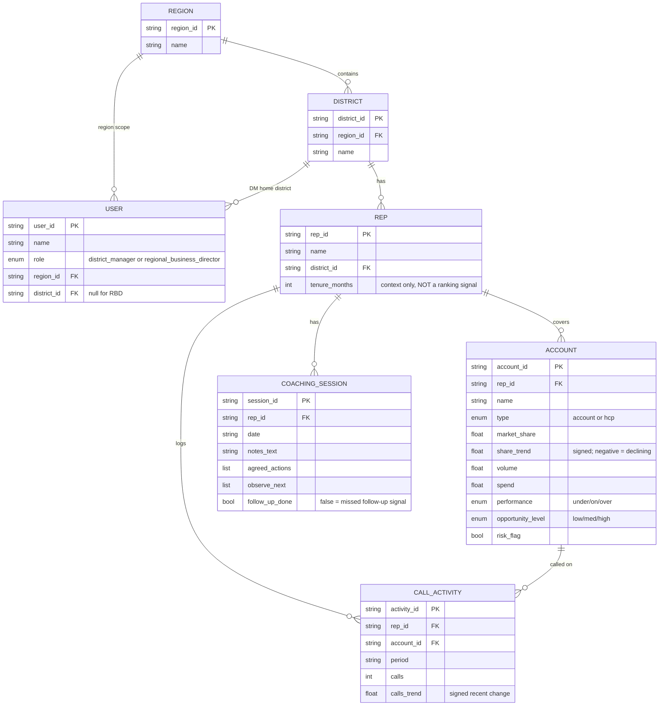
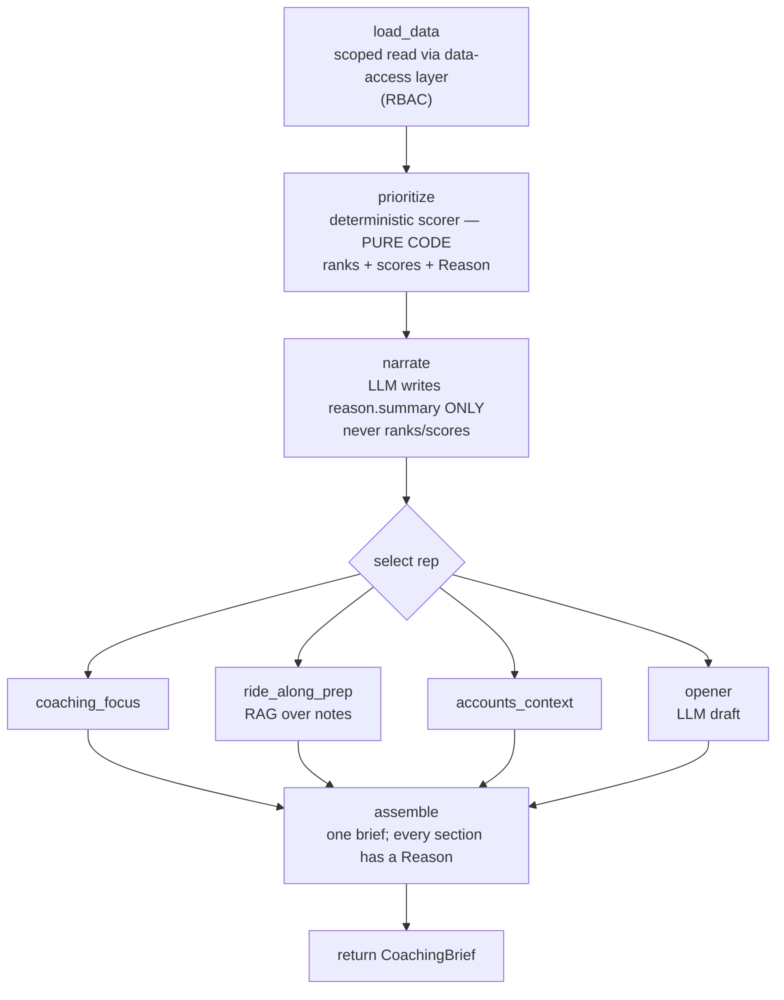

# Technical architecture (MVP)

> **Audience:** engineers. **Scope:** the morning coaching brief MVP.
> Every part below is marked **BUILT NOW (Phase 1)** or **PLANNED (later phase)**.
> Source of truth: `specs/001-morning-coaching-brief/plan.md`,
> `specs/001-morning-coaching-brief/tasks.md`, `CLAUDE.md`, and the code under
> `src/coach/`.

---

## 1. Overview

The system is a layered Python service. Components are organized top-down: people → web
UI → an in-code orchestrator → five brief builders → a **data-access layer** → local
stores. The data-access layer is the **single seam** every component reads through — no
component touches a store directly, so swapping synthetic data for real connectors later
is a source change, not a rewrite. Orchestration lives in **code** (a LangGraph DAG, no
autonomous loops). The **rep ranking is a deterministic scoring function**; the LLM
(Claude on Amazon Bedrock) only turns the structured reason into clear language and drafts
free text — it **never decides or reorders the ranking**. Today only the foundation
(schemas, the data-access interface, the SQLite store, and the synthetic generator) is
built and tested; the orchestrator, the builders, the LLM/RAG layers, the API, and the UI
are planned.

---

## 2. Module / package map

All packages live under `src/coach/`. "Placeholder" = the directory and `__init__.py`
exist but no implementation code yet.

| Package | Responsibility | Key files | Status |
|---|---|---|---|
| `config` | Resolve settings from env: Bedrock model id, region, DB path, seed, fixed ranking weights (model id never hard-coded) | `config/settings.py` | **BUILT** |
| `schemas` | Pydantic entities, the `Reason` object, recommendation objects, the synthetic `Dataset` | `schemas.py` | **BUILT** |
| `data_access` | The single read-seam: `DataAccess` + `Retriever` Protocols, `AccessContext`, `ScopeError`; SQLite store impl | `data_access/interface.py`, `data_access/sqlite_store.py` | **BUILT** (interface + store) |
| `data_access` (RBAC) | Territory scoping + out-of-scope denial enforced in the data layer | `data_access/rbac.py` *(planned)* | **PLANNED** (T008) |
| `data_access` (RAG) | FAISS/Chroma retriever for coaching notes | `data_access/faiss_retriever.py` *(planned)* | **PLANNED** (T011) |
| `synthetic` | Seeded synthetic data generator + CLI (`python -m coach.synthetic.generate`) | `synthetic/generate.py` | **BUILT** |
| `llm` | Bedrock Claude wrapper (narration, opener) + Titan embeddings; model id from config | `llm/client.py`, `llm/embeddings.py` *(planned)* | **PLANNED** (T012, T010) |
| `guardrails` | PII guardrail seam (pass-through in MVP → Bedrock Guardrails) | `guardrails/pii.py` *(planned)* | **PLANNED** (T013) |
| `components` | The 5 brief builders + the separate LLM narration step | `components/prioritization.py`, `narrate.py`, `coaching_focus.py`, `ride_along_prep.py`, `accounts_context.py`, `opener.py` *(planned)* | **PLANNED** (T023–T037) |
| `orchestrator` | LangGraph DAG + brief assembly (rejects any recommendation lacking a reason) | `orchestrator/graph.py`, `orchestrator/brief.py` *(planned)* | **PLANNED** (T015) |
| `observability` | Per-brief / per-LLM audit records; field-level data classification; no out-of-scope data or raw PII in logs | `observability/audit.py` *(planned)* | **PLANNED** (T014) |
| `api` | FastAPI app; simulated identity → `AccessContext`; read-only brief endpoints | `api/app.py` *(planned)* | **PLANNED** (T016, T025, T037) |

Placeholder packages today (only `__init__.py`): `llm`, `guardrails`, `components`,
`orchestrator`, `observability`, `api`.

---

## 3. Data-access layer (the seam)

Defined in `src/coach/data_access/interface.py`. This is the contract every component
depends on; concrete stores live behind it.

- **`DataAccess` (Protocol)** — structured reads, each taking an `AccessContext`:
  `get_reps`, `get_rep`, `get_accounts`, `get_call_activity`, `get_business_metrics`,
  `get_coaching_sessions`. Implemented by `SqliteStore` (`sqlite_store.py`). **BUILT.**
- **`Retriever` (Protocol)** — coaching-notes RAG: `search_notes(ctx, rep_id, query, k)`.
  Interface defined; the FAISS/Chroma implementation is **PLANNED** (T011).
- **`AccessContext` (frozen dataclass)** — the caller's identity and scope:
  `user_id`, `role`, `region_id`, `district_id` (set for a DM, `None` for an RBD),
  `read_only` (`True` for an RBD). **BUILT.**
- **`ScopeError`** — raised when a read is outside the caller's territory. Defined now;
  **raising/enforcement is PLANNED** (T008).

**RBAC is enforced HERE — at the data layer, not the UI.** Reads are scoped by territory:
a DM sees only their own district; an RBD sees all districts in their region (read-only).
In production the *same* interface sits in front of real connectors (Aurora/Athena,
Bedrock Knowledge Bases), so callers do not change.

**Current status / honest gaps:** the interface and the SQLite store are built and tested.
`SqliteStore._allowed_district_ids` already partitions `get_reps` by territory, but the
single-id reads (`get_rep`, `get_accounts`, etc.) do **not** yet deny out-of-scope access
— see the `TODO(T008)` marker in `sqlite_store.py`. Hardened enforcement and the dedicated
RBAC tests are **PLANNED** (T008 implementation, T017 tests).

---

## 4. Data model

Entities and fields are taken from `src/coach/schemas.py`. **BUILT.**

`BusinessMetric` is a derived per-account view (`account_id`, `market_share`,
`share_trend`, `volume`, `spend`, `performance`) returned by `get_business_metrics`.

**Explainability objects.** `Reason` carries `summary` (non-empty), `signals`
(`SignalContribution`: signal, `raw_value`, `weight`, `contribution`), and `data_points`
(`DataPoint`: label, value, source). Every recommendation object — `RepRanking`,
`CoachingFocus`, `AccountFocus`, `Opener` — has a **required** `reason: Reason` with no
default, so the schema makes a reason-less recommendation impossible to construct.

---

## 5. Orchestration (LangGraph) — PLANNED

A single explicit LangGraph DAG (no loops) wires the builders. **PLANNED** (T015, plus the
per-node wiring tasks). The planned design:

- **Shared state** — one object threaded through the graph: the `AccessContext`, the loaded
  in-scope data, the ranked reps, the selected `rep_id`, and the accumulating brief
  sections (each a recommendation with its `Reason`).
- **Nodes** — one per builder: `load_data` (scoped read via the data layer), `prioritize`
  (deterministic ranking, **pure code**), `narrate` (LLM, **writes only `reason.summary`**),
  then for the selected rep `coaching_focus`, `ride_along_prep`, `accounts_context`,
  `opener`, and finally `assemble`.
- **Edges/order** — fixed and linear (a DAG). `assemble` (in `orchestrator/brief.py`)
  rejects any section whose recommendation lacks a non-empty reason.
- **Separation rule** — `prioritize` computes ranks/scores in code; the separate `narrate`
  node may change only `reason.summary` text, never ranks or scores.

---

## 6. Deterministic ranking — PLANNED

The ranking is a pure function in `components/prioritization.py`. **PLANNED** (T023; tests
T020, T021, T022a).

- **Fixed, visible weights** from `config.settings` (`COACH_WEIGHT_*`, default 0.25 each),
  applied to four signals: **declining share**, **low call activity in key accounts**,
  **missed coaching follow-up**, **opportunity/risk**.
- **Output** — `list[RepRanking]` sorted by `total_score`, each carrying a structured
  `Reason` (the `SignalContribution`s with raw value, weight, and contribution, plus the
  `DataPoint`s used). A stable, documented tie-break keeps ordering deterministic.
- **Fairness** — only the four business signals drive the score. Protected attributes and
  proxies are excluded; e.g. `tenure_months` is explicitly context-only, never a signal.
  The **fairness test** (T022a) perturbs a non-signal field and asserts ranks/scores are
  unchanged.
- **Anti-LLM-ranking guard** (T021) — snapshots ranks + scores before narration, runs the
  LLM, then asserts ranks and scores are byte-for-byte identical afterward; the LLM may
  change only `reason.summary`.

---

## 7. Coaching-notes RAG — PLANNED

For ride-along prep (`components/ride_along_prep.py`). **PLANNED** (T010, T011, T030).

- **Embeddings** — Amazon Titan on Bedrock (`llm/embeddings.py`), model id from config.
- **Vector store** — local FAISS/Chroma behind the `Retriever` Protocol
  (`data_access/faiss_retriever.py`).
- **Use** — retrieve a rep's prior coaching notes, then return structured `agreed_actions`
  / `observe_next`; an `EmptyState` is returned for a rep with no sessions.
- **Scope** — retrieval is RBAC-scoped like every other read; in production the retriever
  maps to Bedrock Knowledge Bases / OpenSearch.

---

## 8. LLM integration

Claude on **Amazon Bedrock**, via `llm/client.py`. **PLANNED** (T012, T024, T027, T036).

- **Model id from config** — read from `BEDROCK_MODEL_ID` (see `config/settings.py`);
  **never hard-coded** (Constitution VIII). A grep confirms no model literal in `src/`.
- **Where the LLM IS used:** narrating a structured `Reason` into clear language
  (`components/narrate.py`); phrasing coaching-focus reason text
  (`components/coaching_focus.py`); drafting the opener (`components/opener.py`).
- **Where the LLM is NOT used:** the **ranking** — ranks and scores are computed only by
  the deterministic scorer. The LLM cannot create, reorder, or change them.

---

## 9. Explainability contract

Every recommendation carries a structured `Reason` that the UI renders. Enforced at three
levels:

1. **Schema (BUILT)** — `reason: Reason` is required on `RepRanking`, `CoachingFocus`,
   `AccountFocus`, and `Opener`; `Reason.summary` has `min_length=1`. Tested by
   `tests/unit/test_schemas.py` (T019).
2. **Runtime guard (PLANNED)** — `orchestrator/brief.py` assembly rejects any section whose
   recommendation lacks a non-empty reason (T015).
3. **Rubric e2e (PLANNED)** — the 5-section checklist test passes only if all five sections
   are present and each shows a visible reason (T038).

---

## 10. Security, privacy, guardrails

- **RBAC at the data layer** — scope enforced in `data_access`, not the UI (Section 3).
  Built for `get_reps`; full enforcement + denial is **PLANNED** (T008/T017).
- **Field-level data classification (PLANNED, T014)** — rep fields = HR-sensitive; HCP
  fields = private (IQVIA/PDRP). The audit logger uses this to know which fields must never
  be emitted (FR-016).
- **No sensitive fields in logs (PLANNED, T040)** — audit records carry no out-of-scope
  data and no raw PII; a privacy-in-logging test asserts rep/HCP-sensitive fields are never
  serialized outside their allowed scope.
- **Guardrails (PLANNED, T013)** — a PII guardrail seam (`guardrails/pii.py`), pass-through
  in the MVP, mapping to **Amazon Bedrock Guardrails** in production.
- **Synthetic-only (BUILT + PLANNED)** — data is labeled `synthetic=true`
  (`GenerationMeta`); a **git pre-commit hook** (`.githooks/pre-commit`) blocks committing
  files that look like real data **(BUILT)**; a synthetic-only e2e test asserts every
  response is synthetic and no real connector is configured **(PLANNED, T041)**.

---

## 11. Testing strategy

pytest, organized as a pyramid under `tests/`.

- **Unit (BUILT today):** `tests/unit/test_data_access.py` and
  `tests/unit/test_schemas.py`. **17 tests pass** (Phase 1).
- **Unit (PLANNED):** deterministic scorer (T020), RBAC (T017), fairness (T022a).
- **Component (PLANNED):** one per builder against seeded data (T021, T022, T026, T029,
  T032, T035), including the golden/anti-LLM-ranking guard (T021).
- **End-to-end (PLANNED):** full brief + the **5-section checklist rubric** (T038), audit /
  privacy-in-logging (T040), synthetic-only (T041), quickstart scenarios (T042).
- **Cross-cutting checks:** seeded **determinism** (same seed → identical data; built and
  tested today), the **fairness** test, the **anti-LLM-ranking** guard, **privacy-in-
  logging**, and the **consistency** check (same DM → identical brief skeleton, T038).

---

## 12. Config & runtime

- **Settings** — `coach.config.settings.Settings` / `get_settings()`, all from env:
  `BEDROCK_MODEL_ID`, `AWS_REGION`, `BEDROCK_EMBED_MODEL_ID`, `COACH_DB_PATH` (default
  `./data/coach.db`), `COACH_SEED` (default 42), and `COACH_WEIGHT_*` ranking weights.
- **Environment / deps** — [`uv`](https://docs.astral.sh/uv/): `uv sync` to install;
  `uv run pytest` to test; `uv run ruff check --fix . && uv run ruff format .` to lint.
- **Data generator CLI (BUILT)** — `uv run python -m coach.synthetic.generate --seed 42`
  writes the seeded dataset through the store to `--db` (default `COACH_DB_PATH`) and prints
  per-table counts.
- **API entrypoint (PLANNED)** — `uvicorn coach.api.app:app --reload`
  (`coach.api.app:app`); not runnable yet.

---

## 13. From POC to production

Each MVP piece is built to swap for a managed AWS service behind the same interface.

| MVP piece (now) | AWS service | Why |
|---|---|---|
| Orchestrator + builders | **LangGraph + Claude on Amazon Bedrock** | Keep orchestration in code; managed, governed model inference |
| Structured store (SQLite/DuckDB) | **Amazon Aurora / Athena** | Managed relational/analytical store behind the same `DataAccess` interface |
| Notes store (FAISS/Chroma) | **Amazon Bedrock Knowledge Bases / OpenSearch** | Managed RAG + vector search behind the same `Retriever` interface |
| Identity → `AccessContext` | **Amazon Cognito** | Real authn/authz feeding the data-layer RBAC |
| PII guardrail seam | **Amazon Bedrock Guardrails** | Managed PII/safety filtering at the model boundary |
| Local / container run | **AWS hosting** | Same FastAPI app and web UI, deployed on AWS |

---

*Last verified against the repo at Phase 1 (foundation complete; 17 unit tests passing).*
